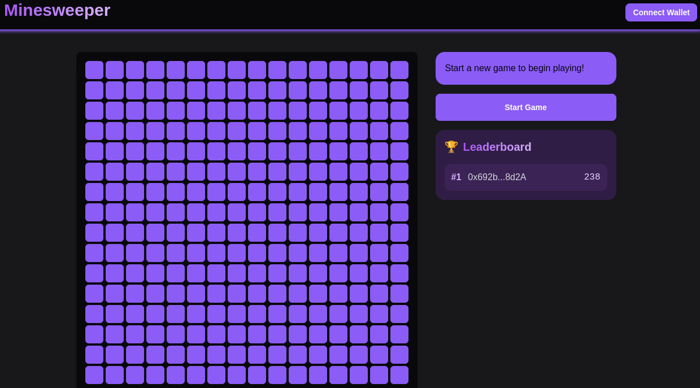

# 🏗 Scaffold-ETH 2

<h4 align="center">
  <a href="https://docs.scaffoldeth.io">Documentation</a> |
  <a href="https://scaffoldeth.io">Website</a>
</h4>

🧪 An open-source, up-to-date toolkit for building decentralized applications (dapps) on the Ethereum blockchain. It's designed to make it easier for developers to create and deploy smart contracts and build user interfaces that interact with those contracts.

⚙️ Built using NextJS, RainbowKit, Hardhat, Wagmi, Viem, and Typescript.

- ✅ **Contract Hot Reload**: Your frontend auto-adapts to your smart contract as you edit it.
- 🪝 **[Custom hooks](https://docs.scaffoldeth.io/hooks/)**: Collection of React hooks wrapper around [wagmi](https://wagmi.sh/) to simplify interactions with smart contracts with typescript autocompletion.
- 🧱 [**Components**](https://docs.scaffoldeth.io/components/): Collection of common web3 components to quickly build your frontend.
- 🔥 **Burner Wallet & Local Faucet**: Quickly test your application with a burner wallet and local faucet.
- 🔐 **Integration with Wallet Providers**: Connect to different wallet providers and interact with the Ethereum network.



## Requirements

Before you begin, you need to install the following tools:

- [Node (>= v20.18.3)](https://nodejs.org/en/download/)
- Yarn ([v1](https://classic.yarnpkg.com/en/docs/install/) or [v2+](https://yarnpkg.com/getting-started/install))
- [Git](https://git-scm.com/downloads)


## Run the minesweeper

```
yarn chain
yarn deploy --network localhost
yarn start
```

## 前端发布配置

```
touch packages/nextjs/utils/scaffold-eth/customChains.ts
```
编辑customChains.ts文件

```
import { defineChain } from "viem";

// monad testnet chain
export const monadTestnet = defineChain({
  id: 10143,
  name: "Monad Testnet",
  nativeCurrency: { name: "MON", symbol: "MON", decimals: 18 },
  rpcUrls: {
    default: {
      http: ["https://testnet-rpc.monad.xyz"],
    },
  },
  blockExplorers: {
    default: {
      name: "Monad Explorer",
      url: "https://testnet.monadexplorer.com/",
    },
  },
});
```
修改packages/nextjs/scaffold.config.ts

```
//   targetNetworks: [chains.hardhat], 改成
targetNetworks: [monadTestnet],
```


## 合约部署


在 hardhat.config.ts 中配置 monadTestnet 网络

```
monadTestnet: {
      url: "https://testnet-rpc.monad.xyz",
      accounts: [deployerPrivateKey],
      chainId: 10143
    },
```

然后设置部署账户

```
yarn account:import
```


最后部署
```
yarn deploy --network monadTestnet
```


Minesweeper deployed to: 0xE58e8c58AD2F955973A8195be9992fFFE5aCdC94

MinesweeperNFT deployed to: 0xAFF9E7E5e7582366A9e10F9bf5b72330cDECB58E

